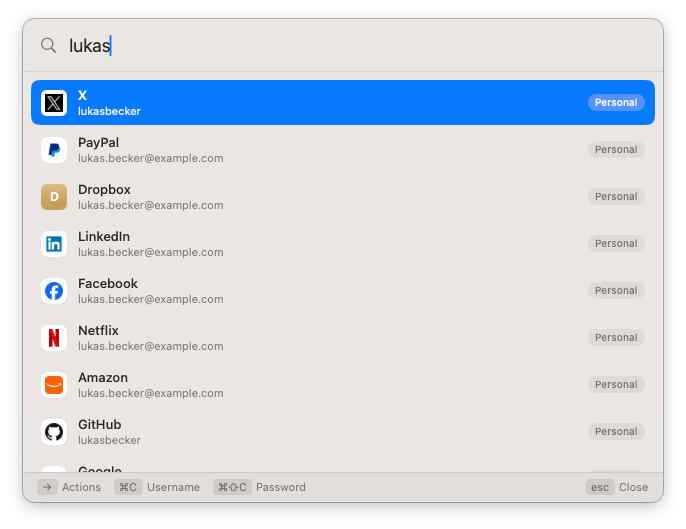
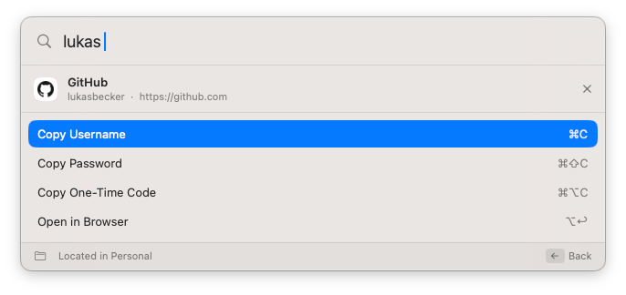
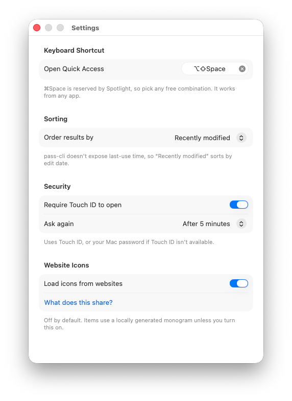

# Pass Quick Access

[](https://github.com/bsramin/pass-quick-access/actions/workflows/ci.yml)


A native macOS quick-access window for [Proton Pass](https://proton.me/pass).
Press a keystroke from any app, search your logins, and copy a username,
password or one-time code, or open the item's site in your browser. The same
idea as 1Password's Quick Access, built for Proton Pass, which ships an Electron
desktop app and no native quick-access of its own.

> Not affiliated with or endorsed by Proton AG.

## Screenshots

| Search | Item detail | Settings |
| --- | --- | --- |
|  |  |  |

## How it works

The app does not reimplement Proton's authentication or cryptography. It drives
the official [`pass-cli`](https://github.com/protonpass/pass-cli), the
Proton-maintained command-line client, and wraps it in a native macOS UI.

```
 ┌──────────────────────────────────────────┐
 │ Floating panel (AppKit NSPanel + SwiftUI) │
 │   hotkey ▸ search ▸ pick ▸ copy / open    │
 └───────────────┬──────────────────────────┘
                 │ metadata only (titles, URLs, usernames)
 ┌───────────────▼──────────────────────────┐
 │ PassCLIClient  (actor over pass-cli)      │
 │   vault list · item list · item view      │
 └───────────────┬──────────────────────────┘
                 │ secrets fetched just-in-time, never cached
 ┌───────────────▼──────────────────────────┐
 │ pass-cli  ▸  Proton Pass servers          │
 └──────────────────────────────────────────┘
```

## Features

- **Floating search panel** summoned by a global hotkey (default ⌥⇧Space,
  configurable). It opens over any app without pulling you out of it, and
  dismisses when it loses focus.
- **Search that matches Proton Pass**: the same substring, diacritic-insensitive,
  multi-word matching as the official client, over titles, usernames, emails,
  URLs, notes and custom fields. Results are ordered by most recently modified
  or alphabetically.
- **Item detail view** with copy actions, each shown only when the item has that
  field:
  - Copy Username
  - Copy Password
  - Copy One-Time Code
  - Open in Browser, with a chooser when an item has several URLs
- **Keyboard driven**: arrows to move, Page Up/Down and Home/End to jump, `→`
  to open an item, `←` to step back, `esc` to close.
- **Resume**: reopen within 30 seconds of an action and you land back on the
  same item, to grab another field.
- **Optional Touch ID lock** with a configurable timeout, falling back to your
  Mac password.
- **Website icons** are off by default; items show a locally generated monogram.
  You can opt in to fetching favicons, with a clear notice of what that shares.
  Favicons are never fetched for local or private addresses, including hostnames
  that resolve to one, so the feature stays off your local network.

## Security model

- **Secrets are never persisted or indexed.** The in-memory index holds only
  titles, URLs, usernames and the presence of a password or one-time code, never
  the secret values. Passwords and codes are read fresh from `pass-cli` at the
  moment you copy them, handed to the pasteboard, and the pasteboard entry is
  marked concealed and cleared after 30 seconds.
- **Authentication lives in `pass-cli`.** The app holds no Proton credentials and
  relies on the CLI's existing session.
- **The trust boundary is that session.** Anyone who can run code as your user
  can already read everything through `pass-cli` directly, so the app is careful
  not to be a weaker link: nothing is written to disk, and signed release builds
  use the hardened runtime without `get-task-allow` so other processes can't
  attach.
- An optional Touch ID lock guards casual access to an unlocked Mac. It is not a
  defense against local code execution.

## Requirements

- macOS 14 or later
- [`pass-cli`](https://github.com/protonpass/pass-cli) installed and logged in
  (`pass-cli login`). The CLI requires a paid Proton Pass plan.
- [XcodeGen](https://github.com/yonaskolb/XcodeGen) to generate the project

## Build and run

```sh
xcodegen generate
xcodebuild -scheme PassQuickAccess -destination 'platform=macOS' -derivedDataPath build build
open build/Build/Products/Debug/PassQuickAccess.app
```

Run the tests with:

```sh
xcodebuild -scheme PassQuickAccess -destination 'platform=macOS' test
```

`PassQuickAccess.xcodeproj` is generated from `project.yml` and is not checked
in. By default the project builds ad-hoc signed; to sign with your own Apple
Developer identity, copy `Config/Local.xcconfig.example` to
`Config/Local.xcconfig` and fill in your team.

## Limitations

- The CLI is the only supported way in. There is no public Proton Pass API, so
  the app is as capable as `pass-cli` and no more.
- Ordering uses the item's modification time. The official app also factors in
  last-use time, which `pass-cli` does not expose. If you'd like it to, vote for
  [this Proton feature request](https://protonmail.uservoice.com/forums/953584-proton-pass-authenticator/suggestions/51396523-cli-expose-and-update-last-used-time-for-items).
- Distribution is currently build-from-source. A notarized release needs an
  Apple Developer ID certificate (a paid Apple Developer Program membership);
  [sponsoring the project](https://github.com/sponsors/bsramin) would help cover
  it, so builds could open without a Gatekeeper prompt.

## Contributing

See [CONTRIBUTING.md](CONTRIBUTING.md). Security reports go through
[SECURITY.md](SECURITY.md).

## License

[GNU General Public License v3.0](LICENSE). This is a community project and is
not affiliated with or endorsed by Proton AG.
